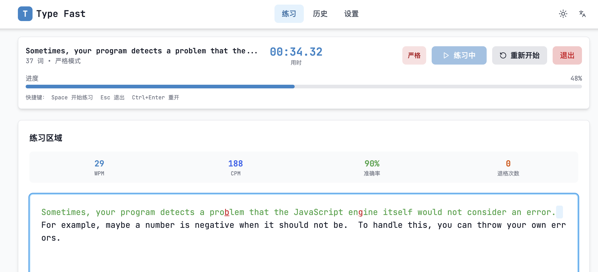

# Type Fast - 英文打字练习应用

一个Web应用，用于练习英文打字速度与准确率。支持自定义文本、实时统计、历史记录对比等功能

## 功能预览

### 练习页面

*练习界面，支持实时统计和错误提示*

### 输入界面

*直观的文本输入和错误显示*

### 素材库

*丰富的练习素材，支持自定义文本输入*

### 历史记录

*详细的练习历史统计和进度追踪*

### 设置页面

*个性化设置，包括主题、模式等配置*

## 使用指南

### 开始练习

1. **选择文本来源**
   - 自定义文本：输入或粘贴你想要练习的英文文本
   - 素材库：从预置的文章中选择
   - 近期使用：快速选择最近练习过的文章

2. **开始练习**
   - 点击"开始练习"按钮
   - 系统开始计时，高亮当前应输入的字符
   - 实时显示WPM、CPM、准确率等指标

3. **练习模式**
   - **宽容模式**: 输入错误可以继续，错误会被记录但不影响进度
   - **严格模式**: 输入错误必须回退更正，确保100%准确率

### 查看历史

- 在"历史"页面查看所有练习记录
- 按文章分组显示练习历史
- 对比不同时间的成绩表现
- 分析进步趋势和最佳成绩

### 自定义设置

- 在"设置"页面调整各种参数
- 选择主题和视觉样式
- 配置练习模式和声音设置
- 管理数据导入导出

## 数据指标

### WPM (Words Per Minute)
- **基于单词**: 按空格分词计算每分钟单词数
- **基于字符**: 按5字符=1词的标准计算

### CPM (Characters Per Minute)
- 每分钟输入的字符数

### 准确率
- 正确字符数 / 总击键数 × 100%

## 技术特性

- 🚀 **现代化技术栈**: React + Vite + Tailwind CSS
- 🌍 **国际化支持**: 中英文双语界面
- 🎨 **主题切换**: 浅色/深色主题自动切换
- 💾 **本地存储**: 数据持久化，无需注册账号
- 🐳 **Docker支持**: 一键部署，支持容器化

## 快速开始

### 本地开发
```bash
# 克隆项目
git clone <repository-url>
cd type-fast

# 安装依赖
npm install

# 启动开发服务器
npm run dev
```

### Docker部署
```bash
# 拉取镜像
docker pull peiranxu2048/typefast:latest

# 运行容器
docker run -d -p 8080:80 peiranxu2048/typefast:latest
```

## 贡献指南

欢迎提交Issue和Pull Request！

**Happy Typing! 🚀**
